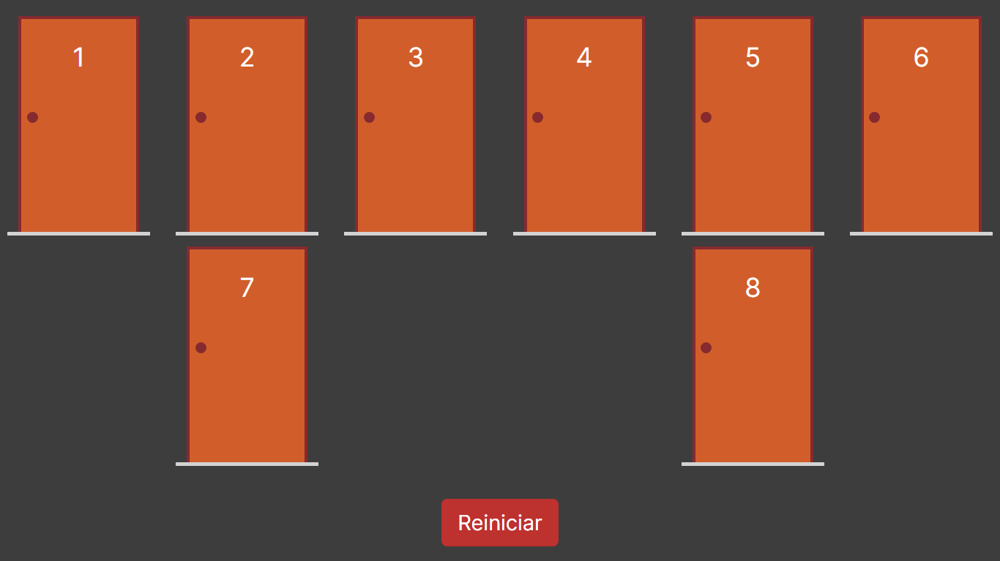
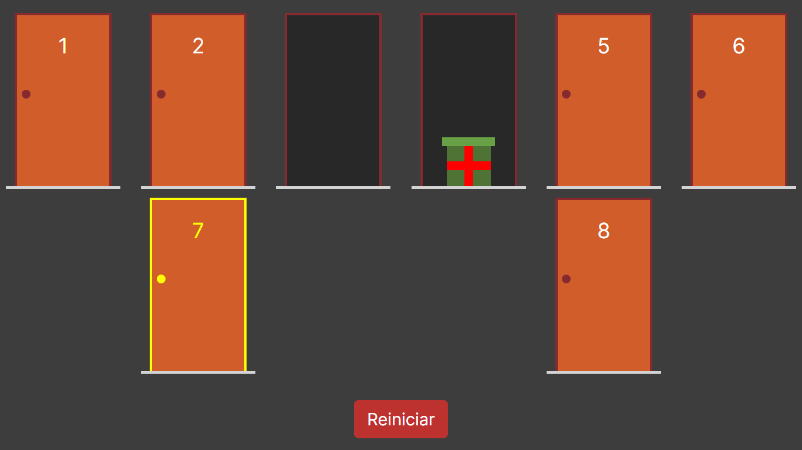

## Monty hall - NextJs 14 + Typescript

O Monty Hall Problem é um quebra-cabeça estatístico que ganhou notoriedade em programas de televisão. Neste simulador, você pode explorar e visualizar as estratégias associadas ao problema de Monty Hall

<b>Menu inicial</b>

<b>Monty hall</b>

<b>Monty hall - Completo</b>

## Licença 

Este projeto está licenciado sob a [Licença MIT](LICENSE).